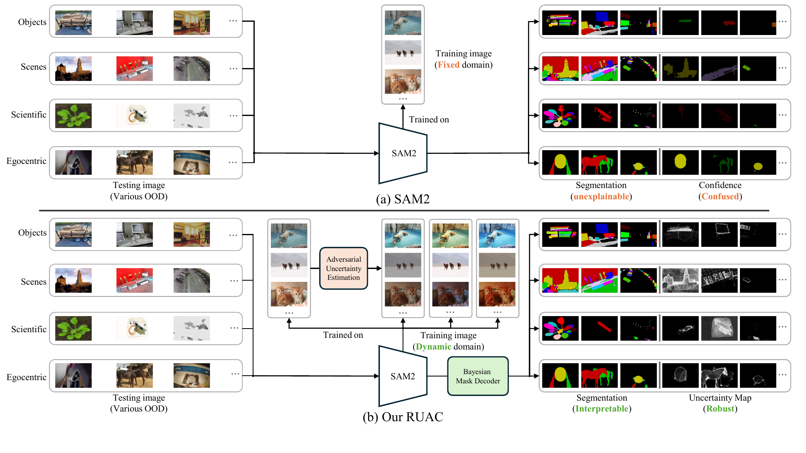

# RUAC: Robust Uncertainty-Accuracy Correlation for SAM2

Reference implementation for the ICML 2026 paper:

> **Segment Anything with Robust Uncertainty-Accuracy Correlation**
> Hongyou Zhou¹, Marc Toussaint¹, Ling Shao², Zihan Ye²✉
>
> ¹ Learning and Intelligent Systems, Technical University of Berlin, Germany
> ² UCAS-Terminus AI Lab, University of Chinese Academy of Sciences, China
> ✉ Corresponding author: [zihhye@outlook.com](mailto:zihhye@outlook.com)



*Across 23 OOD domains (Objects · Scenes · Scientific · Egocentric),
vanilla SAM2 trained on a fixed source domain produces unexplainable
masks and confused confidence maps. RUAC introduces a dynamic training
domain (AUE: bio-inspired style and deformation perturbations) and a
Bayesian mask decoder (UE), yielding interpretable segmentation and
uncertainty maps that track prediction error.*

## Overview

SAM2's only confidence output is a single mask-level IoU score, which
decorrelates from actual error under domain shift (paper calls this
*Mask-level Confidence Confusion*). RUAC adds two pieces to fix this:

* **Uncertainty Estimation (UE).** The vanilla mask decoder's hypernet
  pixel path is replaced by a Bayesian head over both image tokens and
  mask tokens, parameterised as Weibull variational posteriors (BNDL,
  Hu et al., ICLR 2025). Per-pixel uncertainty is read off in closed
  form (analytic) or via Monte Carlo sampling.
* **Adversarial Uncertainty Estimation (AUE).** A style network (AdaIN
  + GCN-based multi-object coordination) and a deformation network
  (DG-Font-style flow + grid sampling) generate adversarial inputs in
  image space. Gradient Reversal makes them adversarial against the
  segmentation model, while a symmetric dual-stopgrad calibration loss
  (``L_cal_sym``, paper Eq. 5 + mirror) keeps predicted uncertainty
  aligned with prediction error even on these perturbed samples.

The two are trained jointly under a curriculum: clean-only → +Bayesian
KL → +AUE adversarial branch.

This repo packages RUAC as a **SAM2 addon** with zero modifications to
SAM2's source: a `BayesianMaskDecoder` subclass, a `SAM2RUACTrain`
subclass, three loss modules (BNDL KL, AUE adversarial, combined
orchestrator), and one Hydra config.

> **Reference code, not a turnkey reproduction package.** Data preparation,
> pretrained checkpoints, and end-to-end runnability are out of scope.
> Reproducing the headline numbers requires training from scratch on MOSE
> plus 22 additional OOD evaluation datasets listed in the paper.

## Install

Three editable installs (this repo plus two forks of upstream packages):

```bash
git clone https://github.com/HongyouZhou/sam2.git
git clone https://github.com/HongyouZhou/BNDL.git
git clone https://github.com/HongyouZhou/ruac.git

pip install -e sam2
pip install -e BNDL
pip install -e ruac
```

The SAM2 fork's training scaffold lives at the top-level `training/`
package (distinct from the inner `sam2/sam2/`), so it must be on
`PYTHONPATH`:

```bash
export PYTHONPATH=$PWD/sam2:$PWD/BNDL:$PWD/BNDL/BNDL_upload:$PYTHONPATH
```

Tested with Python 3.12 and PyTorch 2.x (CUDA 12).

## Train

```bash
python sam2/training/train.py \
  --config-dir ruac/configs \
  --config-name sam2_ruac_train
```

Before this works, edit `ruac/configs/sam2_ruac_train.yaml` to point at
your MOSE training data and set `${PROJECT_HOME}` (or replace those
interpolations inline). The yaml ships one OOD validation dataset block as
a template. Replicate it under `trainer.data.val.datasets` for the
remaining 22 paper domains.

## Project layout

```
ruac/
├── core/                            # model-agnostic math; ZERO `import sam2.*`
│   ├── grl.py                       Gradient Reversal Layer (§3.3)
│   ├── pipeline.py                  AUEPipeline (cooperative attack, DI)
│   ├── bndl/
│   │   └── uncertainty.py           Weibull → entropy uncertainty (BNDLOutputs + analytic, §3.2)
│   ├── attackers/
│   │   ├── base.py                  AdversarialAttacker (factory)
│   │   ├── style.py                 ImageLevelStyleImpl + StyleAdversarialNetwork (§3.3)
│   │   └── deform.py                FeatureLevelDeformationImpl + helpers (§3.3)
│   └── losses/
│       ├── bndl.py                  BNDLLoss (KL regularization, §3.4)
│       ├── aue.py                   AUELoss (attacker objective + L_cal_sym, §3.4)
│       └── combined.py              CombinedSAMBNDLLoss (curriculum γ schedule, §3.5)
├── adapters/
│   └── sam2/                        # SAM2-only glue; ALL `import sam2.*` lives here
│       ├── bayesian_decoder.py      BayesianMaskDecoder (subclass of SAM2 MaskDecoder, §3.2)
│       ├── trainer.py               SAM2RUACTrain (subclass of SAM2Train, §3.5)
│       └── aue_module.py            AUEModule bridge (held by SAM2RUACTrain)
├── modeling/                        # model-agnostic helpers, used by core + adapter
│   ├── style_utils.py               GT-region style stats
│   ├── style_gcn.py                 Style GCN (§3.3)
│   └── aue/
│       ├── config.py                AUEConfig dataclass tree
│       └── visualization.py
└── configs/
    └── sam2_ruac_train.yaml
```

## How RUAC plugs in

`SAM2RUACTrain.__init__` does three things on top of `SAM2Train`:

1. Suppresses the SAM2 fork's own AUE wiring by passing `use_aue=False` to
   `super().__init__()`.
2. Swaps the freshly-built vanilla `MaskDecoder` (constructed by
   `SAM2Base._build_sam_heads`) for a `BayesianMaskDecoder`. The swap is
   needed because that method hard-codes the decoder class.
3. Attaches RUAC's attackers and `AUEModule` under the same attribute
   names the SAM2 fork's inherited `track_step` looks up
   (`style_attacker`, `deform_attacker`, `style_gcn`, `_aue_module`). The
   training loop then exercises RUAC's adversarial branch automatically.

The optimiser, gradient clipper, AMP scaler, and dataset loaders are all
inherited from the SAM2 fork's `Trainer` unchanged. RUAC's Style/Deform
attacker networks train under the single main optimiser: the yaml's
`options.lr` schedule gives them their own cosine `1e-3 → 1e-4` LR group
matched by name pattern (`style_attacker.*`, `deform_attacker.*`,
`style_gcn.*`). GRL inside the attacker networks flips their gradient
sign during the backward, implementing the paper's joint min-max
objective in a single backward pass.

## Code ↔ paper map

For navigating the codebase alongside the paper:

| Paper | Code |
|---|---|
| §3.2 Bayesian mask decoder (UE) | [`ruac/adapters/sam2/bayesian_decoder.py`](ruac/adapters/sam2/bayesian_decoder.py) |
| §3.2 Analytic uncertainty (MacKay probit + Bernoulli entropy) | [`ruac/core/bndl/uncertainty.py`](ruac/core/bndl/uncertainty.py) (`pixel_weibull_to_entropy_uncertainty`) |
| §3.3 Style adversarial network (AdaIN) | [`ruac/core/attackers/style.py`](ruac/core/attackers/style.py) (`ImageLevelStyleImpl`) + [`ruac/modeling/style_utils.py`](ruac/modeling/style_utils.py) |
| §3.3 Style GCN (multi-object coordination) | [`ruac/modeling/style_gcn.py`](ruac/modeling/style_gcn.py) (`AdversarialStyleGCN`) |
| §3.3 Deformation adversarial network (DG-Font, grid sample) | [`ruac/core/attackers/deform.py`](ruac/core/attackers/deform.py) (`FeatureLevelDeformationImpl`, `FeatureBasedDeformModule`) |
| §3.3 Cooperative attack (parallel predict, sequential apply) | [`ruac/core/pipeline.py`](ruac/core/pipeline.py) (`AdversarialPipeline._apply_cooperative_attack`) |
| §3.3 Gradient Reversal Layer | [`ruac/core/grl.py`](ruac/core/grl.py) (`GRL`) |
| §3.4 KL regularisation (Weibull → Gamma prior) | [`ruac/core/losses/bndl.py`](ruac/core/losses/bndl.py) (`BNDLLoss`) |
| §3.4 Symmetric calibration loss `L_cal_sym` (Eq. 5 + dual-SG mirror) | [`ruac/core/losses/aue.py`](ruac/core/losses/aue.py) (`AUELoss._compute_calibration_loss`) |
| §3.4 Attacker objective (task + KL + L_cal_sym, joint min-max via GRL) | [`ruac/core/losses/aue.py`](ruac/core/losses/aue.py) (`AUELoss`) |
| §3.5 Curriculum γ schedule (clean → +BNDL → +AUE) | [`ruac/core/losses/combined.py`](ruac/core/losses/combined.py) (`CombinedSAMBNDLLoss.weight_schedule`) |
| §3.5 SAM2-side wiring | [`ruac/adapters/sam2/trainer.py`](ruac/adapters/sam2/trainer.py) (`SAM2RUACTrain`) |
| §3.5 Hydra config | [`ruac/configs/sam2_ruac_train.yaml`](ruac/configs/sam2_ruac_train.yaml) |

## Reproducibility note

The numbers in the paper were produced on Hiera-B+ (not the largest SAM2
variant) with limited GPU compute, and hyper-parameters were not
exhaustively tuned. We do **not** ship a checkpoint. A larger backbone
(Hiera-L) or longer training is expected to yield better results.

## What is intentionally not included

* **Pretrained checkpoints.**
* **Data preparation scripts.** The 23 OOD datasets in the paper are
  pre-existing public datasets reformatted for the SAM2 VOS data loader.
  Set the paths in the yaml `dataset:` section once you have them.
* **Rebuttal-baseline attackers.** PGD, adversarial patch, random noise,
  MixStyle, DSU, StyleGen, and UR-ERN appear in the paper as baselines but
  are not part of the RUAC method.
* **MMD-based calibration variants.** Earlier experiments explored
  spatial-MMD, hard-aware MMD, domain-aware soft MMD, CKA and Gram-matrix
  alternatives to ``L_cal_sym``. They are not part of the published
  method and are omitted from this reference implementation.

## Citation

```bibtex
@inproceedings{ruac2026,
  title     = {Segment Anything with Robust Uncertainty-Accuracy Correlation},
  author    = {Zhou, Hongyou and Toussaint, Marc and Shao, Ling and Ye, Zihan},
  booktitle = {Proceedings of the 43rd International Conference on Machine Learning},
  year      = {2026}
}
```

## License

MIT (see [`LICENSE`](LICENSE)).
